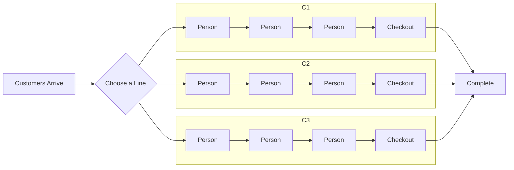
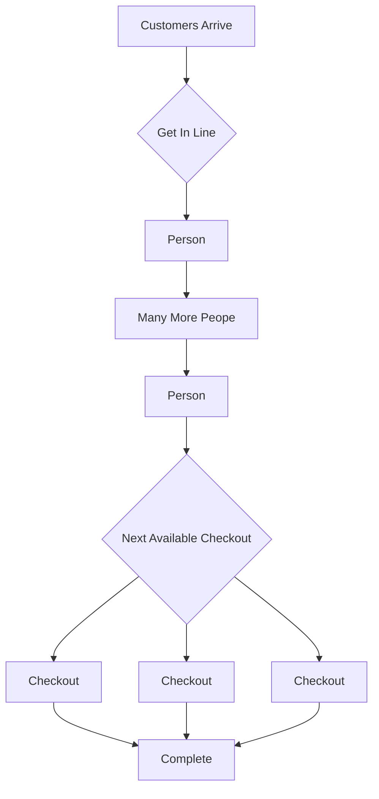

```mermaid
flowchart LR
    A[Customers Arrive] --> B{Choose a Line}
    B --> P1[Checkout Line 1]
    B --> P4[Checkout Line 2]
    B --> P7[Checkout Line 3]
    subgraph C1
        P1[Person] --> P2[Person] --> P3[Person] --> D1[Checkout]
    end
    subgraph C2
        P4[Person] --> P5[Person] --> P6[Person] --> D2[Checkout]
    end
    subgraph C3
        P7[Person] --> P8[Person] --> P9[Person] --> D3[Checkout]
    end
    D1 --> E1[Complete]
    D2 --> E1
    D3 --> E1
```

```mermaid
flowchart TD
    A[Customers Arrive] --> B{Get In Line}
    B --> P1[Person] --> P2[Many More Peope] --> P9[Person]

    P9 --> C{Next Available Checkout}

    C --> D1[Checkout]
    C --> D2[Checkout]

    C --> D3[Checkout]

    D1 --> E1[Complete]
    D2 --> E1
    D3 --> E1
```
