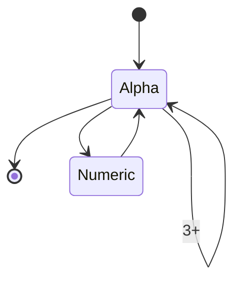

# Contents

# Diagrams

Diagramming is useful to convey concepts that might be difficult to mentally visualize.
One issue with existing diagrammingn tools is they often render out as images, making it impossible to copy/paste from.
They might require a separate tool to edit the diagram.
The diagram itself is not stored in version control, only the image.

# Mermaid

I recently came across Mermaid when looking through remark/rehype plugins.
In essence, Mermaid is a markdown-like syntax for creating diagrams.

In any of the following examples, you can click the "expand" button to see the raw markdown.


Mermaid supports a variety of diagrams, including flowcharts, ER diagrams, state diagrams, and more.



An example of an ER diagram of a database of Users, Classes and Teachers.

```mermaid
erDiagram
    USER ||--o{ CLASS : "enrolled"
    CLASS ||--|{ TEACHER : "assigned"
    USER {
        int id PK "Unique identifier"
        string name "User's name"
        string email "User's email"
        date dateOfBirth "User's birth date"
    }
    CLASS {
        int id PK "Unique identifier"
        string name "Class name"
        string subject "Subject taught"
    }
    TEACHER {
        int id PK "User ID"
        string specialty "Teaching specialty"
    }

```

# Usage

Below is an example of how to integrate Mermaid into a React component.
It takes advantage of the `mermaid.render` function to render the diagram as a SVG string.
Then it loads the SVG string into a `div`.

```tsx
import mermaid from "mermaid";
import { useRandId } from "../lib/react";
import { useEffect, useState } from "react";

export interface MermaidProps {
    diagram: string;
}

mermaid.initialize({
    startOnLoad: false,
});

const Mermaid = (props: MermaidProps) => {
    const { diagram } = props;

    const divId = useRandId("mermaid");
    const [svg, setSvg] = useState<string | null>(null);
    const [divRef, setDivRef] = useState<HTMLDivElement | null>(null);

    useEffect(() => {
        void mermaid.render(divId, diagram).then(({ svg }) => {
            setSvg(svg);
        });
    }, [divRef, diagram]);

    return (
        <>
            <div ref={setDivRef} id={divId} className="mermaid">
                {diagram}
            </div>
            <div dangerouslySetInnerHTML={{ __html: svg ?? "" }} />
        </>
    );
};
```

```tsx
<Mermaid diagram={`
graph TD;
    A-->B;
    A-->C;
    B-->D;
    C-->D;
`}>

```


