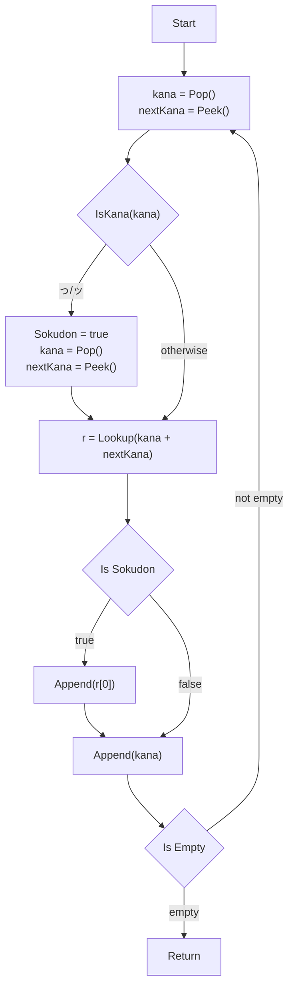

import { Kana } from "../../components/Kana.tsx";

# Contents

# Kana Basics

The following are some of the basic characters that represent two of the three Japanese alphabets.

Hirigana is the most basic alphabet, and is used for native Japanese words.
Katakana is used for foreign words, and is also used for emphasis.

| Hirigana | Katakana | Romaji | Sounds Like |
| -------- | -------- | ------ | ----------- |
| あ       | ア       | a      | father      |
| い       | イ       | i      | eel         |
| う       | ウ       | u      | udon        |
| え       | エ       | e      | empire      |
| お       | オ       | o      | oh          |

| Hirigana | Katakana | Romaji | Sounds Like |
| -------- | -------- | ------ | ----------- |
| か       | カ       | ka     | car         |
| き       | キ       | ki     | key         |
| く       | ク       | ku     | cool        |
| け       | ケ       | ke     | kettle      |
| こ       | コ       | ko     | coat        |

# Kana Unicode

Many modern languages are able to handle unicode characters just fine, including Japanese.
Due to the construction of the kana, we can write some utilities around the kana themselves.

# Kana to Romaji

<Kana text="こんにちは" />

<Kana text="ぼっち ざ ろっく!" />
