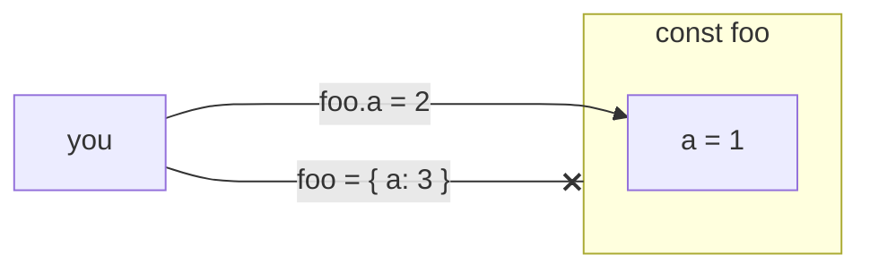

import { MultipleChoiceQuiz as MCQuiz } from "../../components/MultipleChoiceQuiz";
import { FillBlankQuiz as FBQuiz } from "../../components/FillBlankQuiz";

# Contents

# Defining Variables

Variables are used to store different values.
They can be defined using the `const` or `let` keywords.
It is best practice to use `const` by default, as it will prevent unintended reassignment.

| Type     | Description                                    | Example          |
| -------- | ---------------------------------------------- | ---------------- |
| Variable | A variable that can be reassigned.             | `let foo = 4;`   |
| Constant | A constant variable that cannot be reassigned. | `const foo = 4;` |

## Var

It is best practice to avoid the `var` keyword. You may see it used in other JavaScript code, but it is not recommended as it has some unintuitive behavior.

# Types

TypeScript has several different primitive types that can be used.
These types are used to represent the most basic types of data.
They are not references to objects, but the actual values themselves.
Because of this, when declared as `const` they cannot be mutated.

| Type        | Description                                                  | Examples                        |
| ----------- | ------------------------------------------------------------ | ------------------------------- |
| `boolean`   | A true or false value.                                       | `true`, `false`                 |
| `number`    | A number.                                                    | `1` `2` `3.14` `NaN` `Infinity` |
| `string`    | A string of characters.                                      | `'hello'` `"world"`             |
| `null`      | A value that represents nothing.                             | `null`                          |
| `undefined` | A value that represents something that has not been defined. | `undefined`                     |
| `object`    | A collection of key-value pairs.                             | `{ a: 1, b: 2 }`                |
| `array`     | A collection of values.                                      | `[1, 2, 3]`                     |
| `function`  | A function that can be called.                               | `() => { console.log('foo') }`  |

## Primitives

Primitive types are the most basic types in JavaScript.
They represent an individual value.

### Booleans

[Booleans](https://developer.mozilla.org/en-US/docs/Web/JavaScript/Reference/Global_Objects/Boolean) are true or false values. They are used for conditional logic.

```ts
const isDevMode = true;
let isRunning = true;

// ...

isRunning = false;
```

### Numbers

[Numbers](https://developer.mozilla.org/en-US/docs/Web/JavaScript/Reference/Global_Objects/Number) in JavaScript are floating point numbers.
There is no explicit integer type; however, there are utilities for working with integers.

```ts
const age = 21;
const pi = 3.14;
const nan = NaN; // Yes, NaN is a number.
```

### Strings

[Strings](https://developer.mozilla.org/en-US/docs/Web/JavaScript/Reference/Global_Objects/String) are text. They can be defined with either single or double quotes.
By default, JavaScript supports UTF-16 characters.

```ts
const name = "John";
const emoji = "👋";
const hiragana = "こんにちは";
```

### Null & Undefined

[Null](https://developer.mozilla.org/en-US/docs/Glossary/Null) and [undefined](https://developer.mozilla.org/en-US/docs/Glossary/Undefined) are used to represent 'nothing'.
Typically null is used to represent a value that is intentionally empty.
Undefined is used to represent a value that has not been defined.

```ts
const port = undefined;

const defaultPort = 3000;
// ?? = nullish coalescing operator a.k.a. 'defaults to'
const currentPort = defaultPort ?? port;

console.log(currentPort); // 3000
```

## Object Types

An object type is a type that is composed of multiple primitive types.

### Objects

Objects are a collection of key-value pairs.
The keys are always strings, but the values can be any type.

```ts
const foo = {
    a: 1,
    b: "2",
    c: true,
};
```

### Arrays

Arrays are a collection of values. They can be accessed by index.

```ts
const foo = [1, 2, 3];
foo.push(4);
foo[0] = 5;

foo = [1, 2, 3];
// Error: Cannot assign to 'foo' because it is a constant.
```

### Functions

# Functions

Functions are the most common way to encapsulate logic in JavaScript.
They are blocks of code that can be called multiple times with different inputs.
They are also first-class citizens in JavaScript, meaning they can be passed around like any other value.

You can declare functions in two ways: by using the `function` keyword or by using the arrow syntax.

```ts
// Function keyword
function add(a: number, b: number): number {
    return a + b;
}

// Arrow syntax
const add = (a: number, b: number): number => {
    return a + b;
};
```

# Typing Variables

You can give a variable a type by using the `ident: type` syntax.

```ts
const foo: number = 1;
const bar: number = "3"; // Error: Type '"3"' is not assignable to type 'number'.

// You can also use the type inference to infer the type of a variable.
const baz = 1; // baz is inferred to be of type number.
```

Seen above, TypeScript will infer the type of a variable if it is not explicitly defined.
This is called type inference and is recommended for variable assignment.

# Const vs Immutable

Defining a variable with const does not make it immutable (unchangeable).
It only prevents the variable from being reassigned.
Specifically, any primitive type will effectively be immutable when defined with const.
However, objects and arrays can still be mutated.

```ts
const foo = { a: 1 };
foo.a = 2; // foo is now { a: 2 }

foo = { a: 3 };
// Error: Cannot assign to 'foo' because it is a constant.
```



# Quiz

<MCQuiz
    title="Declaring variables."
    choices={{
        let: "let",
        const: "const",
        var: "var",
    }}
    answer={["const", "let"]}
    hint="There are two keywords that are recommended for declaring variables."
    explanation="All three are used to declare variables, but var is not recommended."
    type="multiple"
>
    What are the recommended keywords for declaring variables?
</MCQuiz>

<MCQuiz
    title="Primative types."
    choices={{
        string: "string",
        symbol: "symbol",
        key: "key",
    }}
    answer="symbol"
    type="single"
>
    What type is used to represent a unique value that can be used as an object key?
</MCQuiz>

<FBQuiz title="Typing" code="const foo: BLANK = 1;">
    What type should be used to type the variable foo?
</FBQuiz>
